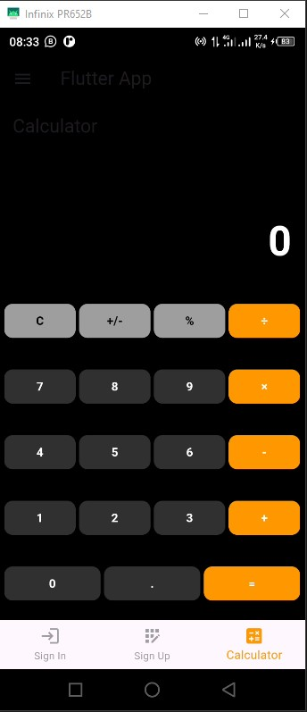
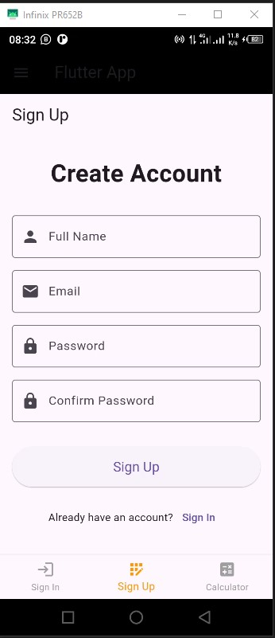
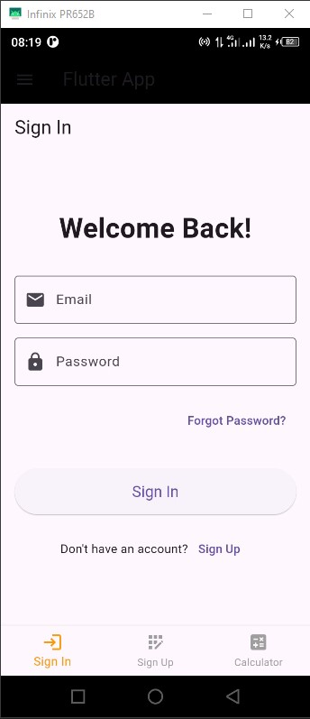

<<<<<<< HEAD
# calculator_app

A new Flutter project.

## Getting Started

This project is a starting point for a Flutter application.

A few resources to get you started if this is your first Flutter project:

- [Lab: Write your first Flutter app](https://docs.flutter.dev/get-started/codelab)
- [Cookbook: Useful Flutter samples](https://docs.flutter.dev/cookbook)

For help getting started with Flutter development, view the
[online documentation](https://docs.flutter.dev/), which offers tutorials,
samples, guidance on mobile development, and a full API reference.
=======
# Flutter Calculator App

A simple calculator app built with Flutter.

## Features

- Basic arithmetic operations (+, -, ×, ÷)
- Decimal point support
- Delete button to remove the last digit
- Sign In and Sign Up screens
- Tab-based navigation with multiple screens (SignIn, SignUp, and Calculator)
- Navigation drawer with a hamburger menu icon and slide-out animation

## Screenshots






## Getting Started

1. Clone the repository:
   ```sh
   git clone https://github.com/SethLoveByiringiro/flutter_calculator_app.git
   cd flutter_calculator_app
